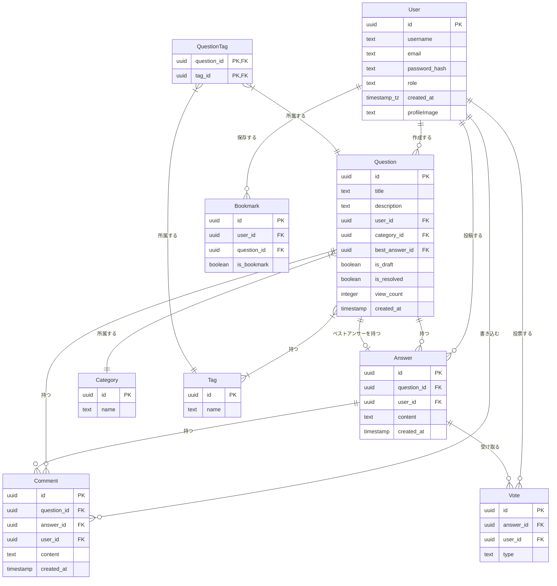

## データベース構造

### ER 図

```mermaid
erDiagram
    %% メインエンティティ
    User {
        uuid id PK
        text username
        text email
        text password_hash
        text role
        timestamp_tz created_at
        text profileImage
    }

    Question {
        uuid id PK
        text title
        text description
        uuid user_id FK
        uuid category_id FK
        uuid best_answer_id FK
        boolean is_draft
        boolean is_resolved
        integer view_count
        timestamp created_at
    }

    Answer {
        uuid id PK
        uuid question_id FK
        uuid user_id FK
        text content
        timestamp created_at
    }

    Comment {
        uuid id PK
        uuid question_id FK
        uuid answer_id FK
        uuid user_id FK
        text content
        timestamp created_at
    }

    %% 補助エンティティ
    Category {
        uuid id PK
        text name
    }

    Tag {
        uuid id PK
        text name
    }

    %% 中間テーブル
    QuestionTag {
        uuid question_id PK,FK
        uuid tag_id PK,FK
    }

    Bookmark {
        uuid id PK
        uuid user_id FK
        uuid question_id FK
        boolean is_bookmark
    }

    Vote {
        uuid id PK
        uuid answer_id FK
        uuid user_id FK
        text type
    }

    %% リレーションシップ
    User ||--o{ Question : "作成する"
    User ||--o{ Answer : "投稿する"
    User ||--o{ Comment : "書き込む"
    User ||--o{ Bookmark : "保存する"
    User ||--o{ Vote : "投票する"

    Question ||--o{ Answer : "持つ"
    Question ||--o{ Comment : "持つ"
    Question }|--|| Category : "所属する"
    Question ||--o| Answer : "ベストアンサーを持つ"

    Question }|--|{ Tag : "持つ"
    QuestionTag }|--|| Question : "所属する"
    QuestionTag }|--|| Tag : "所属する"

    Answer ||--o{ Comment : "持つ"
    Answer ||--o{ Vote : "受け取る"
```
